<div align="center">



### Engenharia Eletrônica e de Computação · UFRJ

**Embedded systems · Applied AI · Automation**

Construo sistemas que conectam **hardware, software e inteligência** — do circuito ao produto.

<br/>

<a href="https://www.linkedin.com/in/SEU-LINKEDIN">

</a>
&nbsp;
<a href="mailto:gabriel.robalo@outlook.com.br">

</a>
&nbsp;
<a href="https://lattes.cnpq.br/6770070890433954">

</a>

<br/><br/>


</div>

<br/>

---

## `01` — NOW BUILDING

<table>
<tr>
<td width="50%" valign="top">

### ⚡ Embedded Systems

Projetos envolvendo **ESP32, sensores, displays, motores e eletrônica digital**.

Do bring-up de hardware e comunicação serial até firmware, aquisição de dados e interfaces físicas.

</td>

<td width="50%" valign="top">

### ◉ Applied AI

**Agentes, MCP, automação e ferramentas que operam software real.**

Uso IA quando ela resolve um problema de engenharia — não apenas para colocar "AI" no projeto.

</td>
</tr>

<tr>
<td width="50%" valign="top">

### ⚙ Automation

Automação de processos reais com **Python, APIs, visão computacional e controle de aplicações legadas**.

Planilha → sistema → resultado.

</td>

<td width="50%" valign="top">

### 🔬 Research

Pesquisa aplicada em **Avaliação de Ciclo de Vida, medição experimental e automação científica**.

UFRJ · openLCA · Python · ISO 14044

</td>
</tr>
</table>

<br/>

## `02` — ENGINEERING

```text
HARDWARE
ESP32 / ESP32-S3     RP2040     Raspberry Pi
SPI / I²C / UART     NFC/RFID   Sensors
Displays             Motors     Digital Logic

SOFTWARE
Python               C          TypeScript
React Native         Expo       Firebase
Make / BSDmake       Linux      FreeBSD

AI & AUTOMATION
MCP / FastMCP        Claude Code
Multi-agent systems  APIs
Computer automation  Computer vision

METHOD
Spec-driven development
Experimental measurement
Systematic literature review
Life Cycle Assessment
```

<br/>

## `03` — PROOF OF WORK

<div align="center">


</div>

<br/>

<div align="center">


</div>

<br/>

> **The graph above is the point.**
>
> Code, commits and projects — not a game.

<br/>

## `04` — SELECTED WORK

<table>
<tr>
<td width="50%" valign="top">

### 🧠 Synapsis

Sistema de estudos baseado em **spaced repetition**, inicialmente desenvolvido em Python.

`Python` · `Algorithms` · `Learning Systems`

</td>

<td width="50%" valign="top">

### 📡 Sentinela Offshore

Conceito de instrumentação vestível para **rastreabilidade de exposição ocupacional**, combinando sensores, armazenamento seguro e assinatura criptográfica.

`Embedded` · `Sensors` · `Security`

</td>
</tr>

<tr>
<td width="50%" valign="top">

### 🏗️ Structural Dynamics

Sistema de aquisição e excitação para estudar **ressonância, frequência natural e amortecimento** em estruturas.

`ESP32` · `MPU-6050` · `Instrumentation`

</td>

<td width="50%" valign="top">

### 🤖 AI Infrastructure

Ferramentas e infraestrutura para **agentes de IA, MCP servers e automação de software**.

`Python` · `MCP` · `Agents`

</td>
</tr>
</table>

<br/>

## `05` — BACKGROUND

**UFRJ** · Engenharia Eletrônica e de Computação
Pesquisa em automação de **Avaliação de Ciclo de Vida** com openLCA + Python.

Antes da universidade: **robótica competitiva**, FLL e F1 in Schools.

Hoje, concentro meus projetos em uma interseção:

```text
             HARDWARE
                 │
                 ▼
        ┌─────────────────┐
        │     SOFTWARE    │
        └─────────────────┘
                 │
                 ▼
               AI
                 │
                 ▼
          REAL-WORLD USE
```

<br/>

<div align="center">

### Let's build something.

<a href="mailto:gabriel.robalo@outlook.com.br">

</a>

<br/><br/>

<sub>Open to internships, research and collaboration.</sub>

</div>
