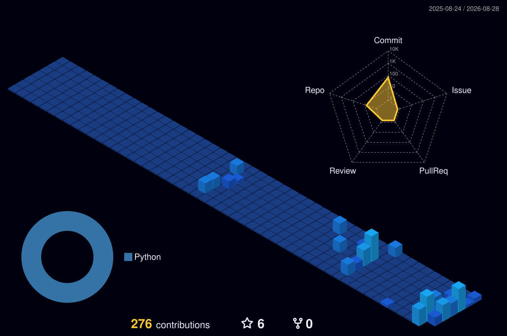

<div align="center">


<br/>

<a href="https://www.linkedin.com/in/SEU-LINKEDIN"></a>
<a href="mailto:gabriel.robalo@outlook.com.br"></a>
<a href="https://lattes.cnpq.br/6770070890433954"></a>


</div>

---

<table>
<tr>
<td width="62%" valign="top">

```console
gabriel@poli-ufrj:~$ whoami --verbose

  NOME .......... Gabriel
  BASE .......... Rio de Janeiro, BR
  CURSO ......... Eng. Eletrônica e de Computação — UFRJ / Poli
  DESDE ......... 2025
  PESQUISA ...... Iniciação Científica — IA, IoT, Engenharia de Software, Hardware e TinyML
  FOCO .......... embarcados · agentes de IA · automação · dado confiável

gabriel@poli-ufrj:~$ cat manifesto.txt

  Não gosto de projeto que fica bonito no slide e morre no protoboard.
  Construo a coisa inteira: firmware, backend, agente, e o processo
  chato que faz aquilo virar rotina de alguém.

gabriel@poli-ufrj:~$ uptime
  building since 2025 · 0 dias sem começar projeto novo ▊
```

</td>
<td width="38%" valign="top" align="center">



</td>
</tr>
</table>

---

## `~/stack`

<div align="center">


</div>

```text
EMBARCADOS   ESP32-S3 · RP2040 · Arduino · ESP-IDF · SPI/I²C · ST7789 · NFC/RFID
LINGUAGENS   Python · C · C++ · JavaScript/TypeScript
IA           Claude Code · MCP (FastMCP) · subagents · RAG · TinyML (pesquisa)
AUTOMAÇÃO    pywinauto · pyautogui · APIs bancárias · scraping · pipelines Excel
APP/BACKEND  React Native · Expo · Supabase
FERRAMENTAL  Linux · FreeBSD · Make · RCS/Git · openLCA IPC
```

---

## `~/projects --status=active`

<table>
<tr><td width="34%">

### `SENTINELA Offshore`
**Wearable ocupacional + gêmeo digital**

ESP32-S3 acoplado ao EPI com sensores de temperatura, ruído, postura e zona/GPS.
Registro assinado no dispositivo, cadeia de custódia e trilha para o eSocial S-2240.
Hardware, firmware e regulatório (NR-37, PGR, LGPD) desenhados juntos.

`ESP32-S3` `sensores` `blockchain` `3D print`

</td><td width="33%">

### `acv-mcp`
**Servidor MCP para openLCA**

Um MCP que recebe "faça a ACV de uma garrafa PET" e constrói o inventário inteiro
dentro do software: busca materiais, casa com a base de dados, monta o product
system e valida. Arquitetura FastMCP, um mini-servidor por fase da ISO 14044.

`Python` `FastMCP` `openLCA IPC` `ISO 14044`

</td><td width="33%">

### `Blip`
**Gadget de mesa ESP32 + display**

Monolito impresso em 3D com tela de 2.8" mostrando consumo de contexto em tempo
real, mais um modo mascote. Firmware, daemon local e industrial design próprios.

`ESP32 CYD` `LVGL` `firmware` `produto`

</td></tr>
<tr><td>

### `Rally`
**App da comunidade de futevôlei**

Agendamento de sessões, ranking por comunidade, confirmação cruzada de partidas
e sistema Rei/Pato. Conceito validado com pesquisa n=65, PRD e 9 specs antes da
primeira linha de código.

`React Native` `Expo` `Firebase` `spec-driven`

</td><td>

### `Automação fiscal`
**Robôs para escritório de contabilidade**

Scripts que leem planilha e preenchem declarações da Receita (IR, DIMOB) e
emitem boletos via API bancária em lote. Automação de app Delphi legado com
pywinauto, tratamento de popup e detecção por imagem.

[`automacao_IR`](https://github.com/gabrieldevcode/automacao_IR) · [`verifica_coordenadas`](https://github.com/gabrieldevcode/verifica_coordenadas)

</td><td>

### `Drone / Lab`
**Eletrônica de bancada**

Controlador de voo próprio em ESP32, bancada maker completa, orquestrador de
quarto com CYD + tags NFC, e um display IPS com carinha animada que reage ao que
acontece na tela do PC.

`flight control` `NFC` `ST7789` `3D print`

</td></tr>
</table>

---

## `~/research`

```text
[ ativo   ] Iniciação Científica — orquestração em lote de Avaliação de Ciclo de
            Vida no openLCA via Python. Orientação: Prof. Rodrigo (UFRJ).

[ ativo   ] Frente de P&D em resfriamento de data centers no Brasil — controle
            que escolhe dinamicamente a estratégia (ar externo, circuito fechado,
            evaporativo) minimizando água + energia, com ACV como função de custo.

[ leitura ] Revisão sistemática em TinyML / ML embarcado: quantização, pruning e
            inferência em microcontrolador (Scopus + Web of Science).

[ base    ] Robótica competitiva — FLL (Technozacca) e F1 in Schools (Cariotoca).
```

---

## `~/arcade` — os commits viram jogo

> A navinha abaixo é gerada todo dia a partir do meu gráfico de contribuições real:
> cada célula é arrancada da grade, vira invasor e é abatida em ondas.

<div align="center">

<picture>
  <source media="(prefers-color-scheme: dark)" srcset="https://raw.githubusercontent.com/gabrieldevcode/gabrieldevcode/output/commit-invaders-dark.svg">
  <source media="(prefers-color-scheme: light)" srcset="https://raw.githubusercontent.com/gabrieldevcode/gabrieldevcode/output/commit-invaders.svg">
  
</picture>

<picture>
  <source media="(prefers-color-scheme: dark)" srcset="https://raw.githubusercontent.com/gabrieldevcode/gabrieldevcode/output/snake-dark.svg">
  <source media="(prefers-color-scheme: light)" srcset="https://raw.githubusercontent.com/gabrieldevcode/gabrieldevcode/output/snake-light.svg">
  
</picture>



</div>

---

## `~/telemetry`

<div align="center">


</div>

---

## `~/now`

```text
[####################----] SENTINELA — definindo MVP de sensores e firmware
[################--------] acv-mcp   — fases 3 e 4 da ISO 14044 + relatório
[############------------] Blip      — firmware e industrial design
[########----------------] C++       — projeto de estudo com spec-driven dev
```

<div align="center">
<br/>

**Aberto a estágio, pesquisa e colaboração** — embarcados, IA aplicada e automação.

<sub><code>if (problema.chato && problema.repetitivo) return automatizar(problema);</code></sub>

</div>
